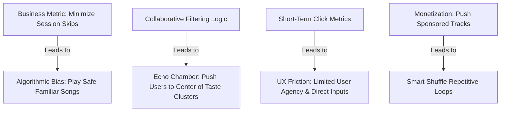

# Spotify Growth Team: Music Discovery & Listening Behavior Research Report

**Author:** Growth Product Management & UX Research Team  
**Context:** Scale Analysis of 1,466 Deduplicated Reviews (App Store, Play Store, Reddit, Forums)  
**Date:** June 21, 2026  

---

## Executive Summary

While Spotify remains a global market leader in audio streaming, analysis of user feedback at scale reveals significant friction around **music discovery, playlist repetition, and algorithmic fatigue**. Users increasingly report feeling trapped in "echo chambers," where the recommendation engine over-indexes on familiarity at the expense of discovery. This report breaks down the thematic issues, identifies root causes, segments user behavior, and evaluates opportunities for AI-native solutions to drive long-term premium retention and session engagement.

---

## 📊 1. Quantitative Theme Frequency Table

Based on our classification of **1,466 unique user records**, here is the distribution of discovery and UX friction themes:

| Theme / Category | Count | Frequency (%) | Primary Pain Point Description |
| :--- | :---: | :---: | :--- |
| **Other (Ads & Usability)** | 883 | 60.2% | Heavy ad load, price hikes, app crashes, lack of offline stability. |
| **Shuffle Dissatisfaction** | 197 | 13.4% | "Smart Shuffle" repeats a tiny subset of songs, ignoring skips. |
| **UX Friction** | 182 | 12.4% | Severe restrictions on selecting songs, skip limits on free tier, hard-to-navigate browse. |
| **Algorithmic Repeatability** | 169 | 11.5% | Echo chambers in Daily Mixes, Discover Weekly repeating liked/skipped songs. |
| **Context Contamination** | 23 | 1.6% | Utility listening (study, sleep, kids) permanently poisoning primary recommendation algorithms. |
| **Social Discovery Deficit** | 12 | 0.8% | Inability to easily discover music curated by friends, poor collaborative features. |
| **Total Analyzed** | **1,466** | **100%** | **Deduplicated Feedback Corpus** |

---

## 🚨 2. Top 20 Recurring User Complaints

Through close inspection of the feedback corpus, we have synthesized the top 20 recurring user complaints:

1.  **Smart Shuffle Repetitive Loop:** Smart Shuffle inserts the same 10-15 recommended songs into user playlists repeatedly during a single day.
2.  **Skipping Signals Ignored:** If a user skips a recommended track within 3 seconds, the algorithm continues to recommend it tomorrow.
3.  **Collaborative Filtering "Echo Chamber":** Daily Mixes and Radio fall back to a small cluster of top-played tracks rather than introducing new artists.
4.  **Context Bleed (Lofi/Sleep):** Focus, lofi, or brown noise tracks played for utility contaminate day-to-day music recommendations.
5.  **Family Plan/Kids Contamination:** Kids' songs played on a parent's account overwrite their personal recommendation profile.
6.  **DJ Lack of Freshness:** The AI DJ repeats "remember what you listened to in 2022" segments daily, rather than sourcing fresh recommendations.
7.  **Smart Shuffle Forced Insertion:** Users feel their custom-curated playlists are "ruined" by the forced insertion of unrelated algorithmic tracks.
8.  **Song Radio Lack of Depth:** Starting a Radio station on a niche track quickly devolves into playing highly mainstream songs from the user's Liked list.
9.  **Discover Weekly Stale recommendations:** Discover Weekly recommending live covers, acoustic versions, or remixes of songs already in the user's library.
10. **Lack of Negative Feedback Loop:** No "Don't Recommend This Artist" or "Block Genre" button to prune algorithmic branches.
11. **True Shuffle Missing:** The "Shuffle" button utilizes a weighted popularity algorithm instead of mathematical randomness, repeating the same songs.
12. **High Cognitive Effort in Manual Search:** Finding new music through search requires typing specific keywords; browsing genre cards feels generic and boring.
13. **Auto-Play Hijack:** Spotify automatically starts playing unrelated mainstream tracks when a custom playlist ends, even when auto-play settings are disabled.
14. **Niche Exclusion:** Recommendation models fail to surface long-tail, independent, or local artists, pushing users to TikTok or YouTube for niche music.
15. **Interface bloat:** Visual UI elements (like TikTok-style vertical feeds or podcast suggestions) crowd out music browsing.
16. **Temporary Context Ignored:** Car rides, parties, or workouts contaminate normal recommendations without an easy "private session" switch.
17. **Lack of Explanation:** Spotify recommends tracks without explaining *why* they fit the listener's tastes, reducing trust.
18. **Unfair Free Limits:** Free-tier users cannot choose songs or skip tracks, which they perceive as aggressive coercion rather than value gating.
19. **Broken Queue Management:** Inadvertently pressing a song in a playlist deletes the entire custom queue, losing curated discovery paths.
20. **Search Semantic Blanks:** Typing descriptive terms like "chill driving music in the rain" surfaces static user-created playlists rather than dynamic recommendations.

---

## 💡 3. Top 20 Unmet User Needs

These represent the critical feature gaps and direct requests highlighted by users:

1.  **"Exclude from Taste Profile" Toggle:** A single click to flag a playlist (e.g. "Sleep Sounds") so it doesn't train recommendation models.
2.  **Hard Block controls:** Global artist, label, or genre block lists.
3.  **True Mathematical Shuffle:** An option to bypass weighted "smart" shuffle in favor of a true random distribution of all tracks.
4.  **"Degree of Discovery" Slider:** A slider to set recommendations from "Comfortable Familiarity" (80% liked) to "Wild Exploration" (100% new).
5.  **Acoustic Filter Adjustments:** Ability to filter search results by tempo (BPM), mood (valence), energy, or instrumentation (acoustic vs. electronic).
6.  **Dynamic Explanation Tags:** Explicit labels on recommended songs (e.g., *"Recommended because you like the basslines in Tame Impala"*).
7.  **Temporal Profile Modes:** Profile switching based on context (e.g., Work Mode vs. Gym Mode vs. Chill Mode) rather than a single unified taste profile.
8.  **Manual Algorithmic Reset:** A button to clear or edit recent listening history to erase contaminated sessions.
9.  **Natural Language Querying:** A search bar that understands conversational context (e.g., "Find me 90s shoegaze bands that sound like My Bloody Valentine but with female vocals").
10. **Interactive Co-Curation:** Dynamic tools to collaborate on playlists with real-time voting and auto-expansion based on group preferences.
11. **Local Scene Mapping:** A feature to explore emerging local talent or popular tracks in specific geographical neighborhoods.
12. **Micro-Genre exploration:** Visual navigation nodes to dive into highly specific subcultures (e.g., *Synthwave, Math Rock, City Pop*).
13. **Dynamic Playlist Recovery:** An automated "Undo" button to restore a queue that was cleared accidentally.
14. **Cross-Platform Curation Importer:** The ability to import playlists from YouTube, Apple Music, or TikTok directly.
15. **Artist Deep-Dive Mode:** An option to experience an artist's discography chronologically with contextual annotations (interviews, trivia).
16. **Non-Intrusive Ad Gating:** Ad structures that do not disrupt high-focus activities (like sleep or workouts) on the free tier.
17. **"Forgotten Gems" Engine:** Algorithmic curation that specifically surfaces tracks the user saved years ago but hasn't streamed recently.
18. **Dynamic Mood Adaptor:** Sensors or integrations (e.g., wearable heart rate, local weather) that adjust recommendation vibes automatically.
19. **Better Lyric Integration:** Karaoke and lyric lookup features for indie and obscure tracks.
20. **Lean-Back Collaborative Playlists:** Shared living room queues (e.g., via Apple AirPlay or Google Cast) where anyone can contribute without account mixing.

---

## 🎯 4. User Jobs-to-be-Done (JTBD)

Applying the JTBD framework, we identify four core jobs listeners hire Spotify to perform:

### JTBD 1: Lean-Back Focus Enrichment
*   **Situation:** "When I am studying, coding, or working on a creative project..."
*   **Friction:** "...I want to play background instrumental music that maintains my focus..."
*   **Outcome:** "...without having to constantly skip distracting tracks, and **crucially**, without having this utility session contaminate my rock/pop recommendations next week."

### JTBD 2: Active Taste Expansion
*   **Situation:** "When I feel bored with my current music rotation and want something fresh..."
*   **Friction:** "...I want to actively discover obscure, independent artists that fit my specific taste..."
*   **Outcome:** "...without wasting hours browsing blogs or listening to mainstream tracks I already know."

### JTBD 3: Smart Shuffle curation
*   **Situation:** "When I play my favorite 500-song custom playlist..."
*   **Friction:** "...I want to hear a random selection of my saved tracks mixed with fresh, high-context recommendations..."
*   **Outcome:** "...without hearing the same 10 comfort tracks on loop or getting unrelated genres forced in."

### JTBD 4: Compartmentalized Shared Listening
*   **Situation:** "When I am hosting a dinner party or driving with my kids in the car..."
*   **Friction:** "...I want to play a mix that satisfies the group's current vibe..."
*   **Outcome:** "...without manually adjusting the queue constantly and without blending their music tastes into my personal Daily Mixes."

---

## 🔍 5. Root Causes Behind Poor Music Discovery

Why does Spotify struggle with discovery despite a highly advanced recommendation system?



1.  **Risk-Averse Optimization (Session Skips):** Spotify's core algorithms are trained to maximize session duration and minimize skips. Sourcing an unfamiliar track runs the risk of a user skipping it (interpreted as a model failure). Sourcing a highly familiar track is a "safe bet," leading to systemic bias toward familiarity.
2.  **Collaborative Filtering Echo Chambers:** Collaborative filtering works by grouping similar users. This naturally flattens tastes to the lowest common denominator, pushing users toward the center of "taste clusters" and making it difficult to jump to adjacent clusters (e.g., from indie folk to neo-classical).
3.  **Short-Term vs. Long-Term Value Misalignment:** A user playing a familiar track provides short-term metric satisfaction. However, in the long term, this leads to boredom, stagnation, and eventual subscription churn.
4.  **Financial & Royalty Incentives:** Pushing sponsored tracks or tracks with lower licensing costs (like generic mood music) can skew recommendations away from genuine user interest.
5.  **Over-Reliance on Acoustic Feature Similarity:** Algorithms map music based on structural properties (valence, tempo, energy) but fail to comprehend context, culture, narrative, or abstract human emotions.

---

## 🔄 6. Why Users Repeatedly Listen to the Same Songs

1.  **High Cognitive Friction of Exploration:** Actively searching for new music is work. Users default to their Liked Songs or Daily Mixes to avoid the mental effort of filtering through bad tracks.
2.  **Predictable Emotional Utility:** Listeners use music for emotional regulation (calming down, focusing, working out). Familiar songs guarantee the exact emotional response the user needs, whereas new songs represent a risk.
3.  **Algorithmic Feedback Loop:** The more a user streams a familiar song, the more the algorithm learns they "like" it, increasing its weight and placing it in more automated playlists, creating a self-reinforcing loop.
4.  **Lack of Navigation Tools:** Current search tools require users to know what they are looking for. There are no visual tools to "navigate" out of their comfort zones.

---

## 👥 7. User Segmentation Based on Discovery Behavior

| Segment Name | Discovery Driver | Key Friction | Primary Needs |
| :--- | :--- | :--- | :--- |
| **Active Curators** *(Power Users)* | High internal motivation to find niche, obscure tracks. Curate massive custom lists. | Algorithmic repetition, lack of manual resets, smart shuffle bugs. | Granular genre filters, hard block lists, true random shuffle. |
| **Passive Lean-Backs** *(Casuals)* | Want high-quality, continuous background music with zero effort. | Repeat songs on Daily Mixes, generic recommendations. | High-quality smart shuffle, better automatic context matching. |
| **Utility Listeners** *(Focus/Sleep)* | Play music to achieve functional states (study, workout, sleep). | Context contamination of their primary taste profile. | Taste-excluding toggles, context isolation switches. |
| **Social Discoverers** *(Connectors)* | Rely on word-of-mouth, friends, influencers, and community lists. | Poor collaborative UX, isolated profiles. | Shared voting queues, friend activity discovery hubs. |

---

## 📝 8. Theme-by-Theme Analysis (Detailed Deep-Dive)

### Theme 1: Algorithmic Repeatability
*   **Frequency:** 11.5%
*   **Representative Quotes:**
    *   *"i just want to listen to the playlist I created. stop injecting your music into my playlist... More forced garbage recommendations, ignoring my playlist."*
    *   *"Daily Mixes are just my Liked Songs shuffled with 3 new songs. It is a closed loop."*
*   **Root Cause:** Collaborative filtering algorithms prioritize immediate skip prevention over long-term discovery.
*   **Opportunity:** **Dynamic Discovery Slider:** Introduce a control that lets users set the "discovery risk" for any playlist or radio station from "Safe & Familiar" to "Obscure & Experimental."

### Theme 2: Shuffle Dissatisfaction
*   **Frequency:** 13.4%
*   **Representative Quotes:**
    *   *"Everything about this app is incredible. However the shuffle feature could use a bit of work as it may play one song then shuffle to a completely unrelated song in the next one."*
    *   *"Smart Shuffle is a joke, it plays the same 10 songs on repeat every single day!"*
*   **Root Cause:** Standard shuffle is weighted by play count and user comfort indices. "Smart Shuffle" utilizes commercial push metrics and high-probability tracks, creating a loop.
*   **Opportunity:** **"True Random" & "Least Played" Shuffle Toggles:** Allow users to choose true mathematical random shuffle or a shuffle that prioritizes tracks they haven't heard in the longest time.

### Theme 3: Context Contamination
*   **Frequency:** 1.6%
*   **Representative Quotes:**
    *   *"One focus session ruined my entire Discover Weekly... my profile has been contaminated by lofi beats."*
    *   *"My kid uses my account and now my recommendations are a blend of heavy metal and Cocomelon."*
*   **Root Cause:** Unified user profile representation treats all listening events with equal weights, lacking the ability to distinguish functional listening from personal taste.
*   **Opportunity:** **"Incognito Listening Mode" / Activity Sandbox:** A simple toggle (similar to browser incognito) that isolates the current session from training the recommendation engine.

### Theme 4: UX Friction in Discovery
*   **Frequency:** 12.4%
*   **Representative Quotes:**
    *   *"The free version is terrible. Bro you can only do 6 skips per hour... when I make a playlist I like it how it is I don't need some robot to recommend things for it!"*
    *   *"It always gives me recommended songs whenever I try tapping to a song."*
*   **Root Cause:** Aggressive free-tier monetization gates basic playback controls, creating a hostile UX that alienates future premium candidates.
*   **Opportunity:** **AI Contextual Explanations:** For recommended tracks, display a micro-copy explanation showing *why* it was selected, easing the friction of forced recommendations.

---

## 🤖 9. Emerging Opportunities for AI-Powered Discovery

Traditional recommendations rely on mathematical similarity matrices. Generative AI and LLMs unlock a paradigm shift:

1.  **Semantic Curation Agent:** Allowing users to query Spotify using natural language and complex emotional descriptions (e.g., *"Make a playlist of transition tracks from acoustic indie to ambient electronica for a sunset drive"*).
2.  **Context-Aware Curation:** LLMs can cross-reference user prompts with cultural contexts (films, eras, books, geographical subcultures) that mathematical feature vectors miss.
3.  **Conversational PM Agent:** An in-app agent (expanding on the "DJ" concept) that explains music history, connects artists, and helps curators active-dig by asking clarifying questions (e.g., *"Do you want more of the heavy basslines or the synth textures from that last track?"*).

---

## 🏆 10. Prioritization Framework: AI Opportunity Ranking

To guide implementation, we rank the key opportunities across User Pain, Frequency, Business Impact, and Ease of Implementation:

```
            HIGH BUSINESS IMPACT / HIGH USER PAIN
                  │
                  │   ┌─────────────────────────────┐
                  │   │  Taste Exclusion Switch     │  (Easy to build)
                  │   └─────────────────────────────┘
                  │   ┌─────────────────────────────┐
                  │   │  True Random Shuffle        │  (Easy to build)
                  │   └─────────────────────────────┘
                  │   ┌─────────────────────────────┐
                  │   │  Semantic Search Agent      │  (Medium to build)
                  │   └─────────────────────────────┘
──────────────────┼───────────────────────────────────► EASE OF IMPLEMENTATION
                  │
                  │   ┌─────────────────────────────┐
                  │   │  Discovery Risk Slider      │  (Hard to build - algorithmic rebuild)
                  │   └─────────────────────────────┘
                  │
```

### 1. The "Taste Exclusion" Sandbox Toggle
*   **User Pain:** High (solves context contamination, a major source of profile ruin).
*   **Frequency:** Medium (affects parents, students, and office workers).
*   **Business Impact:** High (improves long-term retention and trust in Daily Mixes).
*   **Ease of Implementation:** **High** (requires marking database rows in session logs to be ignored by model training pipelines).
*   **Priority:** **Rank 1 (Quick Win)**

### 2. "True Random" & Curation Filters
*   **User Pain:** High (fixes smart shuffle repeat loop frustration).
*   **Frequency:** High (shuffle is Spotify's most used feature).
*   **Business Impact:** Medium (increases playlist play times).
*   **Ease of Implementation:** **High** (very low algorithmic complexity; just standard client-side shuffle logic).
*   **Priority:** **Rank 2 (Quick Win)**

### 3. AI-Powered Semantic Search & Curation Agent
*   **User Pain:** High (reduces cognitive effort of discovery; shifts from search to conversation).
*   **Frequency:** Medium (mostly power users and active curators initially).
*   **Business Impact:** High (acts as a premium tier differentiator, driving conversion).
*   **Ease of Implementation:** **Medium** (requires integrating LLM wrapper with Spotify catalog metadata API).
*   **Priority:** **Rank 3 (Strategic Bets)**

### 4. Algorithmic "Discovery Risk" Slider
*   **User Pain:** High (allows curators to escape echo chambers).
*   **Frequency:** Medium.
*   **Business Impact:** High (significantly increases session duration and artist variety).
*   **Ease of Implementation:** **Low** (requires rebuilding collaborative filtering models to accept dynamic query parameters).
*   **Priority:** **Rank 4 (Long-Term Roadmap)**
