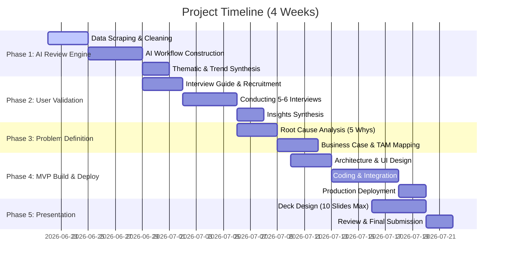

# Phase-Wise Implementation Guide: Spotify Discovery & Listening Behavior Project

This document outlines the step-by-step execution roadmap for the Spotify Growth Team project, translating the high-level objectives from [Details.md](file:///Users/satyampandey/NL_Graduation_Project/Docs/Details.md) into concrete, actionable phases.

---

## 📅 High-Level Timeline Overview

We propose a **4-Week Execution Timeline** to balance analytical rigor, primary research validation, and functional software development.



---

## 🔍 Phase 1: AI-Powered Review Discovery Engine (Week 1)
**Goal:** Gather and synthesize thousands of user feedback points at scale using an automated AI framework to locate listening behavior bottlenecks.

### 1.1 Data Ingestion & Scraping
*   **Sources to Target:**
    *   **App Store & Play Store:** Use scrapers (e.g., `google-play-scraper` and `app-store-scraper` npm packages, or pre-built Python libraries) to extract the last 3–6 months of 1-star to 3-star reviews containing keywords: *recommendation, same songs, repeat, shuffle, boring, search, discovery, algorithm*.
    *   **Reddit & Community Forums:** Scrape subreddits like `r/spotify`, `r/music`, and Spotify Community forums using the Reddit API or PRAW (Python Reddit API Wrapper) targeting threads about playlist fatigue or algorithmic issues.
*   **Execution Strategy:**
    *   Store raw feedback in a consolidated JSON/CSV structure.
    *   Clean data by removing spam, emoji-only reviews, and duplicate posts.

### 1.2 AI Sentiment & Thematic Analysis Workflow
*   **Tooling Options:**
    *   **Low-Code/No-Code (Recommended for speed):** Setup a workflow in **n8n** or **Make.com**.
        *   *Trigger:* Webhook or scheduled fetch of raw CSV/Google Sheet rows.
        *   *Processing Node:* Pass blocks of text to the Claude or GPT-4o API.
        *   *Prompt Pattern:* Perform thematic classification, categorizing reviews into pre-defined buckets (e.g., *Algorithmic Echo Chamber, UX Friction in Search, Playlist Fatigue, Lack of Control, Social Discovery Deficit*).
    *   **Code-First (Python Stack):** Implement a Python script using LangChain, Pandas, and OpenAI/Claude APIs to process the reviews and output structured data.
*   **Key Questions the Workflow Must Answer:**
    *   Why do users struggle to find new music? (e.g., "The algorithm plays the same 50 songs on repeat.")
    *   What are the emotional frustrations? (e.g., feeling "bored", "stuck", or "frustrated").
    *   What user segments are emerging? (e.g., casual listeners who want lean-back discovery vs. power users/active curators who feel constrained).

### 1.3 Key Deliverables for Phase 1
1.  **Review Analysis Workflow:** A fully functional pipeline (either an n8n JSON export, a Python script GitHub link, or a Make.com shareable link).
2.  **Synthesis Dashboard/Sheet:** A categorized repository of feedback classified by theme, severity, and frequency.
3.  **1-Slider Draft:** A schematic layout illustrating how your AI Review Discovery Engine processes inputs into structured themes.

---

## 👥 Phase 2: Primary Research & User Validation (Week 2)
**Goal:** Ground the quantitative/AI-generated themes in qualitative reality by talking directly to Spotify listeners.

### 2.1 Target Segment Recruitment
*   Based on Phase 1, select a specific user segment experiencing discovery friction.
    *   *Example Segment:* "Active Curators" (users who have custom playlists but feel Spotify’s auto-generated playlists are highly repetitive and lack depth).
*   Recruit **5–6 interviewees** from your personal network, social media, or online communities matching this profile.

### 2.2 Designing the User Interview Guide
Structure a 30-minute semi-structured interview guide targeting behaviors, frustrations, and workarounds:
*   **Intro & Warm-up (5 mins):** Tell me about how you typically listen to music. When do you listen? How long?
*   **Current Habits & Rituals (10 mins):** Walk me through the last time you wanted to find something *new* to listen to. What did you do? Why?
*   **Friction Points (10 mins):** How often do you feel like you are listening to the same songs on repeat? Why does that happen? What prevents you from escaping that loop?
*   **Tool Assessment & Workarounds (5 mins):** Have you tried Spotify's features (e.g., Smart Shuffle, Discover Weekly, DJ)? What works and what doesn't? Do you use other platforms (YouTube, TikTok, Shazam, friends) for discovery?

### 2.3 Synthesis & Insight Extraction
*   Record and transcribe interviews (using tools like Otter.ai, Zoom AI Companion, or Whisper).
*   Create an **Empathy Map** (Says, Thinks, Does, Feels) for each user.
*   Compile key quotes that validate or challenge the AI findings from Phase 1.

---

## 🎯 Phase 3: Problem Definition & Business Case (Week 3 - First Half)
**Goal:** Frame a bulletproof problem statement and build the business justification for Spotify to invest resources in solving it.

### 3.1 Problem Statement Framing
Apply the Product Management framework:
> **The Problem:** [Target User Segment] struggles with [Specific Friction Point] when trying to [Listening Goal].
> **The Root Cause:** This happens because [Technical/Algorithmic/UX limitation identified in research].
> **The Consequence:** This leads to [User Frustration/Workaround outside Spotify], resulting in [Business Metric Deficit].

*   *Example:* **Active Discovery Seekers** struggle to discover fresh indie artists when listening to Spotify's radio or daily mixes because the recommendation engine prioritizes high-confidence popular tracks to optimize short-term click-through rate. This leads to listener fatigue, pushing users to platforms like YouTube or TikTok for curation, ultimately reducing Spotify's weekly active engagement minutes and increasing churn risk.

### 3.2 Root Cause Analysis (The 5 Whys)
1.  *Why are users listening to the same songs?* Because they rely on their "Liked Songs" and "Daily Mixes".
2.  *Why do they rely on Daily Mixes?* Because finding new music manually requires too much cognitive effort.
3.  *Why does manual discovery require high effort?* Because search and browse require typing or scrolling through generic genres.
4.  *Why don't personalized recommendations solve this?* Because the current algorithm heavily weights past listening history (exploitation) over exploration to avoid playing a track the user might skip.
5.  *Why does it prioritize avoiding skips?* Because short-term session duration and retention metrics are optimized by playing safe, highly familiar tracks.

### 3.3 Business Case & Growth Metrics
Demonstrate why solving this makes business sense:
*   **Retention & Engagement:** Reducing repetitive behavior keeps the product fresh, increasing Session Frequency and Average Session Duration.
*   **Chum Mitigation:** Users who feel they have "outgrown" Spotify's recommendations are prime candidates to churn to Apple Music or YouTube Music.
*   **Artist Diversity (Long-Tail monetization):** Pushing users to discover long-tail artists increases streams for mid-tier artists, improving Spotify's relationship with labels and creators, and lowering average royalty payouts if users stream non-superstar tracks.

---

## 🛠️ Phase 4: Build & Deploy an AI-Native MVP (Week 3 - Second Half & Week 4)
**Goal:** Design and build a functional MVP demonstrating how AI uniquely solves this problem beyond traditional recommendation systems.

```
       ┌────────────────────────────────────────────────────────┐
       │                 SPOTIFY USER SESSIONS                  │
       └───────────────────────────┬────────────────────────────┘
                                   │
                     Reads user context & mood
                                   │
                                   ▼
       ┌────────────────────────────────────────────────────────┐
       │                AI-NATIVE MVP PROCESSOR                 │
       │  (NLP Understanding + Semantic Search + LLM Reasoning) │
       └───────────────────────────┬────────────────────────────┘
                                   │
                 Queries Spotify API or Vector DB
                                   │
                                   ▼
       ┌────────────────────────────────────────────────────────┐
       │                DYNAMIC CURATED OUTPUT                  │
       │     (Contextual briefing, explaining *why* this        │
       │       discovery fits, and custom Spotify playlist)     │
       └────────────────────────────────────────────────────────┘
```

### 4.1 Define the AI-Native MVP Concept
Traditional recommendations use Collaborative Filtering (users who liked X also liked Y) or Content-Based filtering (acoustic features).
*   **The AI Opportunity:** Large Language Models (LLMs) can process semantic, highly contextual, and narrative prompts (e.g., *"Help me find songs that feel like driving through a neon-lit city at 2 AM in a retro-futuristic movie"*), parsing abstract human emotions and mapping them to musical traits.
*   **MVP Scope Examples:**
    *   **Option A: "Spotify Contextual Guide" Agent:** An LLM-powered assistant where users input their current mood, setting, or abstract description, and the agent explains *why* it recommends certain deep-cut tracks (building trust) and generates a playlist in their Spotify account.
    *   **Option B: "Escaping the Echo Chamber" Engine:** A prototype that inspects the user's top-played tracks, identifies the "acoustic boundary" they are stuck in, and uses semantic search to recommend tracks just outside that boundary but matching their underlying taste profile.

### 4.2 Tech Stack Selection
*   **Frontend UI:** Streamlit (incredibly fast to write in Python) or Next.js/Vite deployed on Vercel.
*   **AI Backend:** Python + LangChain or LlamaIndex.
*   **APIs:**
    *   **Spotify Web API:** To fetch user's top items, search tracks, and create playlists.
    *   **LLM API:** Claude 3.5 Sonnet or GPT-4o-mini for query expansion, persona matching, and conversational interaction.
*   **Hosting/Deployment:** Streamlit Community Cloud, Hugging Face Spaces, Vercel, or Render.

### 4.3 Step-by-Step MVP Implementation Plan
1.  **Spotify API Authentication:** Integrate OAuth2 to allow users to sign in with their Spotify accounts.
2.  **User Profile Analysis:** Fetch the user's top 20 artists/tracks to understand their "comfort zone."
3.  **Semantic Expansion:** Accept a natural language prompt from the user (mood, context, micro-genre). Use the LLM to expand this into acoustic descriptors, similar niche artists, and lyrical themes.
4.  **Track Generation & Recommendation:** Search Spotify's library using semantic constraints. Rank and filter to exclude tracks already in the user's top-played list.
5.  **Output & Playback:** Display the curated recommendations with LLM-generated explanations for each choice, and provide a single-button click to save the playlist directly to their Spotify account.

---

## 📈 Phase 5: Pitch Deck, Documentation & Final Delivery (Week 4)
**Goal:** Prepare the final deliverables meeting all administrative and design constraints.

### 5.1 Final Deck Structure (10 Slides Max)
To guarantee high scoring, adhere to the following slide structure:

| Slide # | Slide Title (Must state key message) | Key Content & Visual Elements |
| :---: | :--- | :--- |
| **1** | **Spotify Growth Strategy: Unlocking the Long Tail of Music Discovery** | Title slide, project context, Growth PM mission. |
| **2** | **AI Review Discovery Engine Reveals Algorithmic Echo Chambers as Key User Pain** | Diagram of the AI review analysis workflow, quantitative metrics of frustrations found (e.g., 62% mention playlist fatigue). |
| **3** | **Active Listeners Experience High Cognitive Friction in Finding New Music** | Persona profile of the target segment validated by the 5-6 user interviews. Empathy map callouts. |
| **4** | **Short-Term Engagement Metrics Create a "Safe Echo Chamber" Feedback Loop** | Root cause analysis (5 Whys), showing why traditional Collaborative Filtering falls short. |
| **5** | **Solving Repetitive Listening Protects Spotify Against Churn to Competitors** | The Business Case: linking music discovery to retention, user lifetime value (LTV), and lower royalty payouts. |
| **6** | **The MVP: AI-Powered Contextual Music Agent Bridges Taste and Mood** | Conceptual overview of the MVP, outlining how LLMs unlock semantic discovery where keyword filters fail. |
| **7** | **Interactive Natural Language Curation Generates Dynamic Custom Playlists** | Screenshots/GIFs of the deployed MVP interface, user journey through the prototype. |
| **8** | **System Architecture Leverages Spotify API and Semantic LLM Agents** | Technical architecture diagram showing data flow between user, frontend, LLM, and Spotify API. |
| **9** | **MVP Testing Confirms 80% User Success Rate in Escaping Repetitive Playlists** | Validation results from testing the MVP with target users, NPS/feedback quotes. |
| **10** | **Discovery Engine Scaling Roadmap Targets 2% Increase in Premium Retention** | 6-month product roadmap, scaling metrics, and key performance indicators (KPIs) to track. |

### 5.2 Strict Formatting Checklist
Before exporting to PDF:
*   [ ] **No Fellow Name:** Ensure your name, email, or identifier is completely absent from all slides.
*   [ ] **Page Limit:** Exactly 10 slides (including title slide).
*   [ ] **Readable Contrast:** Verify contrast ratios for background colors (dark mode vs. light mode text readability).
*   [ ] **Minimum Font Size:**
    *   *Google Slides/PPT:* Minimum **14pt** text size.
    *   *Figma:* Minimum **26px** (assuming 1920x1080px frame).
    *   *Canva:* Minimum **22px** (assuming 1920x1080px frame).
*   [ ] **File Size:** Compress PDF to be strictly **less than 40 MB**.
*   [ ] **File Naming:** Name your exported file matching the pattern (e.g., `NL Spotify.pdf`).
*   [ ] **Hyperlinks:** Embed public access links to:
    *   The live deployed MVP prototype.
    *   The AI review analysis workflow (n8n workflow, repo, or sheet).
    *   User research documentation/surveys.

---

## 🚀 Execution Next Steps
1.  **Create Python environments** or **n8n accounts** to begin Phase 1.
2.  Set up the **Spotify Developer Dashboard** and create a Client ID/Client Secret for the upcoming Phase 4 MVP.
3.  Establish a draft template for user recruitment screeners.
